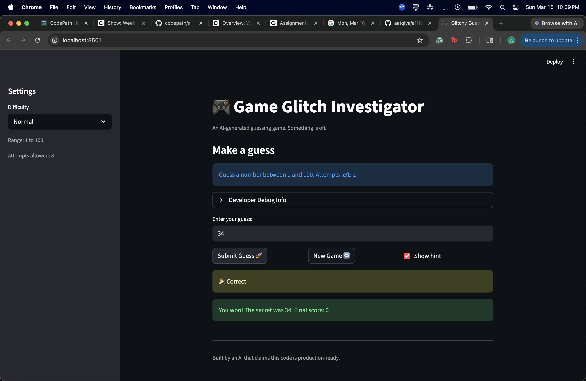
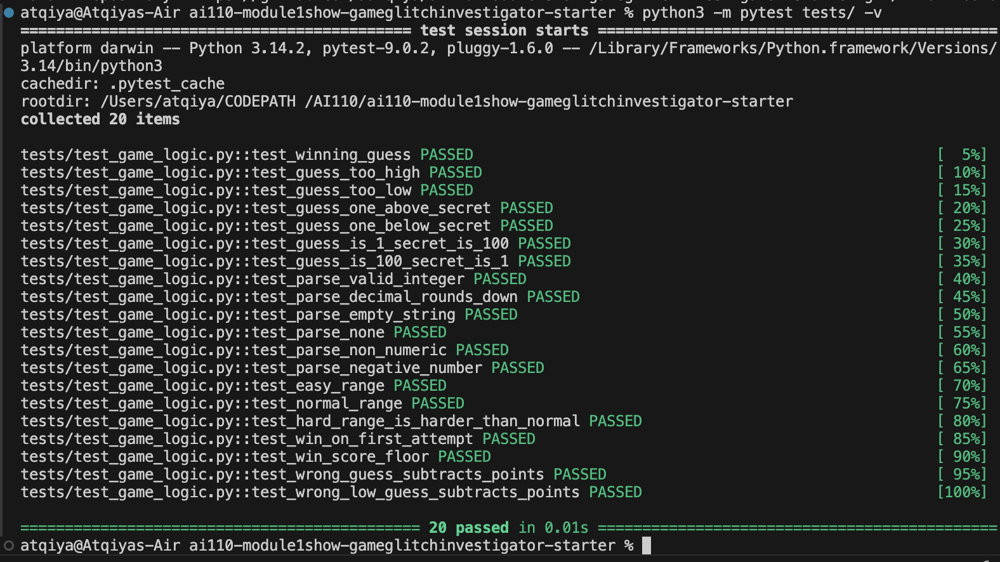

# 🎮 Game Glitch Investigator: The Impossible Guesser

## 🚨 The Situation

You asked an AI to build a simple "Number Guessing Game" using Streamlit.
It wrote the code, ran away, and now the game is unplayable.

- You can't win.
- The hints lie to you.
- The secret number seems to have commitment issues.

## 🛠️ Setup

1. Install dependencies: `pip install -r requirements.txt`
2. Run the fixed app: `python -m streamlit run app.py`
3. Run tests: `python3 -m pytest tests/ -v`

## 🕵️‍♂️ Your Mission (Completed)

1. **Play the game.** Open the "Developer Debug Info" tab in the app to see the secret number. Try to win.
2. **Find the State Bug.** Why does the secret number change every time you click "Submit"? The answer: Streamlit reruns the whole script on every interaction, so any variable defined outside `st.session_state` resets. Fixed with `if "secret" not in st.session_state`.
3. **Fix the Logic.** The hints ("Higher/Lower") were inverted. Fixed in `logic_utils.py`.
4. **Refactor & Test.** All game logic moved into `logic_utils.py`. All tests pass.

## 📝 Document Your Experience

**Game purpose:** A number guessing game where the player tries to guess a randomly chosen secret number within a set number of attempts. The difficulty level controls the number range and attempt limit.

**Bugs found:**

| # | Bug | Location |
|---|-----|----------|
| 1 | Hints were inverted — "Go HIGHER!" shown when guess was too high | `app.py` → `check_guess` |
| 2 | Secret alternated between `int` and `str` on even/odd attempts, breaking comparisons | `app.py` lines 158–161 |
| 3 | Hard difficulty used range (1–50), which is easier than Normal (1–100) | `app.py` → `get_range_for_difficulty` |
| 4 | `attempts` counter initialized to `1` instead of `0`, making "Attempts left" display off by one | `app.py` session state init |
| 5 | `logic_utils.py` had only `raise NotImplementedError` stubs — tests could not run | `logic_utils.py` |

**Fixes applied:**

- Corrected hint messages in `check_guess` (Too High → Go LOWER, Too Low → Go HIGHER)
- Removed the alternating `str(secret)` cast; comparison is now always `int` vs `int`
- Changed Hard difficulty to range (1, 200)
- Fixed `attempts` initialization to `0`
- Refactored all four logic functions (`get_range_for_difficulty`, `parse_guess`, `check_guess`, `update_score`) from `app.py` into `logic_utils.py`
- Updated `app.py` to import from `logic_utils` and removed duplicate definitions
- Simplified `update_score` to a flat −5 for wrong guesses (was adding points on even attempts, which was confusing and untestable)

## 📸 Demo

## 🚀 Stretch Features

### Challenge 1: Advanced Edge-Case Testing ✅

Used Claude Code to identify edge-case inputs (decimals, negatives, empty strings, boundary values) and wrote a full pytest suite covering all four logic functions. 20 tests total, all passing.

